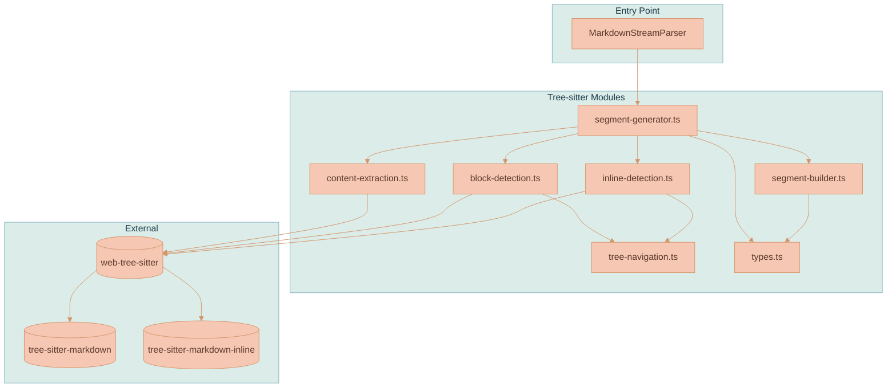
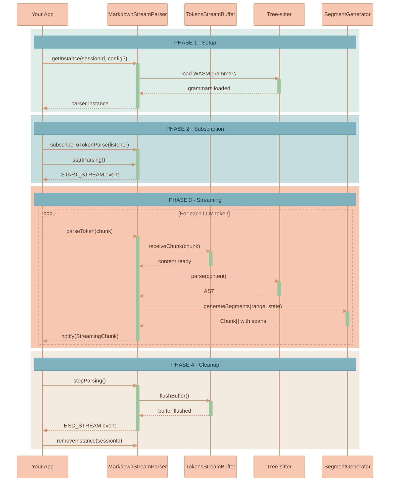
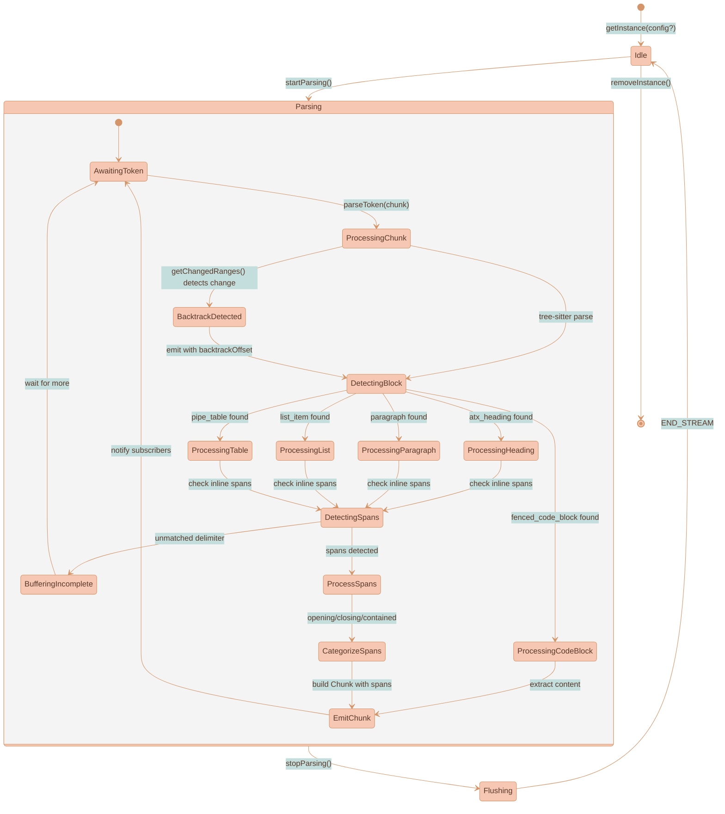

# @lixpi/markdown-stream-parser

A library designed to incrementally parse Markdown text from a stream of tokens.

It uses **tree-sitter** under the hood. Instead of regex pattern matching, we get a proper AST that tells us exactly what's a header, what's a code block, what's bold text, etc. Tree-sitter's error recovery also handles the imperfect markdown that LLMs tend to produce.

### ⚠️ ***This project is still in active development - there are bugs and missing features.***

<br>

### DEMO: [markdown-stream-parser.lixpi.org](https://markdown-stream-parser.lixpi.org)

<br>


## Installation

NPM:
```bash
pnpm i @lixpi/markdown-stream-parser
npm i @lixpi/markdown-stream-parser
yarn add @lixpi/markdown-stream-parser
```

Or just clone the repository and import it directly from the source.

### Importing

The parser supports both ES6 module and CommonJS (Node.js) import styles.

**ES6 import:**
```typescript
import { MarkdownStreamParser } from '@lixpi/markdown-stream-parser'
```

**CommonJS require:**
```typescript
const { MarkdownStreamParser } = require('@lixpi/markdown-stream-parser')
```

Can be used on a backend or frontend, there's no rendering logic involved.


### Basic Concepts

- **Singleton Pattern:**
  Use `MarkdownStreamParser.getInstance(instanceId)` to ensure one parser per logical stream/session.

- **Parsing Lifecycle:**
  - `startParsing()`: Begin parsing and set up subscriptions.
  - `parseToken(chunk: string)`: Feed incoming text chunks.
  - `stopParsing()`: Flush buffers, reset state, and notify listeners of stream end.

- **Subscribing to Output:**
  Use `subscribeToTokenParse(listener)` to receive parsed segments as soon as they are available. Returns an unsubscribe function.
  The unsubscribe function takes no arguments.


## How to Use

There are several ways to use the parser. It is quite modular. You can initialize it in one place and consume the parsed stream elsewhere, thanks to the singleton pattern.

## Subscribing to the Parser

Before you can parse the stream, you must subscribe to the parser. If you do not subscribe in advance, the parser will likely stop and terminate before you receive the first segment.

First import the parser and initialize it with an `instance-id`. (you can have as many parallel parsers as you want, just make sure to use different `instance-id`s)

```typescript
import { MarkdownStreamParser } from '@lixpi/markdown-stream-parser'

// Get a parser instance (singleton per ID)
const parser = MarkdownStreamParser.getInstance('session-1')
```

#### Approach 1: The Simplest

```typescript
// Subscribe to parsed output
parser.subscribeToTokenParse((parsedSegment, unsubscribe) => {
    console.log(parsedSegment) // Happy little parsed segment

    // Clean up when the stream ends
    if (parsedSegment.status === 'END_STREAM') {
        unsubscribe()
        MarkdownStreamParser.removeInstance('session-1')
    }
})
```

#### Approach 2: Customizable

```typescript
// Subscribe to the parser service
const parserUnsubscribe = parser.subscribeToTokenParse(parsedSegment => {
    console.log(parsedSegment) // Happy little parsed segment
})

// When the stream has ended stop the parser to avoid issues and memory leaks.
// You can decide when to terminate the parser.
// For example, using your own logic or rely on the `parser.parsing` flag.
if (!parser.parsing) {
    parserUnsubscribe()    // Unsubscribe from the parser service
    MarkdownStreamParser.removeInstance('session-1')    // Dispose of the parser instance
}
```

## Parsing the Stream

Regardless of which subscription method you choose, feeding the stream into the parser does not change.
Once the subscription to the parser is initialized, you can start parsing the stream.

Again, this can be done in the same file or in a different part of your application. Just make sure to refer to the same parser `instance-id`.

```typescript
import { MarkdownStreamParser } from '@lixpi/markdown-stream-parser'

// Get a parser instance (singleton per ID)
const parser = MarkdownStreamParser.getInstance('session-1')

// Start the parser
parser.startParsing()

// Your iterator function here
for await (const chunk of ["Hello", " ~~world~~", "!", "  \n"]) {
    parser.parseToken(chunk)
}

// Make sure to stop the parser at the end of the stream. It will flush any remaining content from the buffer.
parser.stopParsing()
```

The output is a series of `StreamingChunk` objects. Each chunk contains the text content, UTF-16 offset from the start of the stream, block context, and **orthogonal span information**.

```javascript
{ status: 'START_STREAM' }
{
  status: 'STREAMING',
  chunk: {
    text: 'Hello ',
    offset: 0,
    length: 6,
    block: { type: 'paragraph' },
    opening: [],      // Spans that open but don't close in this chunk
    closing: [],      // Spans that close in this chunk (opened earlier)
    contained: []     // Spans fully contained within this chunk
  }
}
{
  status: 'STREAMING',
  chunk: {
    text: 'world',
    offset: 6,
    length: 5,
    block: { type: 'paragraph' },
    opening: [],
    closing: [],
    contained: [
      { type: 'strikethrough', offset: 6, length: 5 }  // ~~world~~
    ]
  }
}
{
  status: 'STREAMING',
  chunk: {
    text: '!  ',
    offset: 11,
    length: 3,
    block: { type: 'paragraph' },
    opening: [],
    closing: [],
    contained: []
  }
}
{ status: 'END_STREAM' }
```

### Key Concepts in the New API

- **`offset`**: UTF-16 code unit offset from the start of the stream
- **`length`**: UTF-16 code unit length of the text
- **`block`**: Block-level context (`paragraph`, `heading`, `code_block`, `list_item`, `table`, etc.)
- **`opening`**: Spans that start in this chunk but don't close (span continues to next chunks)
- **`closing`**: Spans that close in this chunk (were opened in earlier chunks)
- **`contained`**: Spans fully contained within this chunk


## Consumer Span State Management

The new API uses an **orthogonal model** where chunks and spans are completely independent. Spans can cross chunk boundaries. Consumers must track open spans to properly render styled content.

### How to Track Span State

```typescript
import { MarkdownStreamParser, OpenSpan, ClosedSpan, Chunk } from '@lixpi/markdown-stream-parser'

const parser = MarkdownStreamParser.getInstance('session-1')

// Track currently open spans
let openSpans: OpenSpan[] = []

parser.subscribeToTokenParse((streamingChunk, unsubscribe) => {
    if (streamingChunk.status === 'START_STREAM') {
        openSpans = []  // Reset on new stream
        return
    }

    if (streamingChunk.status === 'END_STREAM') {
        unsubscribe()
        return
    }

    const chunk = streamingChunk.chunk

    // Handle backtracking (parser corrected previous output)
    if (chunk.backtrackOffset !== undefined) {
        // Remove content from offset `chunk.backtrackOffset` onwards
        // Your render buffer should be truncated to this offset
        // Also filter out any open spans that started after backtrackOffset
        openSpans = openSpans.filter(s => s.openOffset < chunk.backtrackOffset!)
    }

    // 1. Add new opening spans to our tracking list
    openSpans.push(...chunk.opening)

    // 2. Process closing spans (remove from tracking, render complete span)
    for (const closingSpan of chunk.closing) {
        // Find and remove the matching open span
        const openIndex = openSpans.findIndex(s => s.type === closingSpan.type)
        if (openIndex !== -1) {
            openSpans.splice(openIndex, 1)
        }
        // Now you have a complete span with offset and length
        // Use closingSpan.offset and closingSpan.length to apply styling
    }

    // 3. Contained spans are already complete (no tracking needed)
    // Just apply their styling: contained.offset, contained.length

    // 4. Render the chunk text with active styles
    const activeStyles = [
        ...openSpans.map(s => s.type),
        ...chunk.contained.map(s => s.type)
    ]
    renderText(chunk.text, chunk.block, activeStyles)
})
```

### Span Types

```typescript
type SpanType = 'bold' | 'italic' | 'code' | 'strikethrough' | 'link' | 'image'

// Opening span: we know where it starts, but it's not closed yet
type OpenSpan = { type: SpanType; openOffset: number }

// Closed/contained span: complete with offset and length
type ClosedSpan = Span & { offset: number; length: number }

// Link and image spans include additional metadata
type LinkSpan = { type: 'link'; url: string; offset: number; length: number }
type ImageSpan = { type: 'image'; src: string; alt?: string; offset: number; length: number }
```

### Handling Backtracking

The parser may sometimes need to **correct** previously emitted chunks. This happens when tree-sitter reinterprets the content as more tokens arrive.

When `chunk.backtrackOffset` is present:
1. **Discard content** from that offset onwards in your render buffer
2. **Filter open spans** to remove any that started after the backtrack offset
3. **Apply the new chunk** which contains the corrected content

```typescript
if (chunk.backtrackOffset !== undefined) {
    // Truncate your output buffer to backtrackOffset
    outputBuffer = outputBuffer.slice(0, chunk.backtrackOffset)

    // Remove spans that are no longer valid
    openSpans = openSpans.filter(s => s.openOffset < chunk.backtrackOffset!)
}
```

### Configuration Options

```typescript
const parser = MarkdownStreamParser.getInstance('session-1', {
    windowSize: 500,              // Lookback window for backtrack detection (chars)
    includeRawStreamedToken: true // Include original token in chunk.original
})

// Or configure after creation
parser.setConfig({ windowSize: 1000 })
```


## Is that it? What am I supposed to do with that?

Good question. You can use this stream to render styled content in your application in real time. Having a `segment type` and `inline styles` is enough to style it however you want.

It will **always remain `render-agnostic`** - whatever you use to render your styled text is entirely up to you.


## Features

- [x] Headers (`# H1`, `## H2`, etc.)
- [x] Paragraphs
- [x] Inline styles
  - [x] Inline Italic (`*text*`)
  - [x] Inline Bold (`**text**`)
  - [x] Inline Bold & Italic (`***text***`)
  - [x] Inline Strikethrough (`~~text~~`)
  - [x] Inline Code (`` `code` ``)
- [x] Code Blocks (```` ```code-block``` ````) with language detection
- [x] Links (`[text](url)`) - with URL extraction
- [x] Images (``) - with src and alt extraction
- [ ] Blockquotes (`> quote`) [Issue #2](https://github.com/Lixpi/markdown-stream-parser/issues/2)
- [ ] //TODO: PRIORITY: Ordered Lists (`1. item`) [Issue #3](https://github.com/Lixpi/markdown-stream-parser/issues/3)
- [ ] //TODO: PRIORITY: Unordered Lists (`- item`, `* item`, `+ item`) *BLOCKED BY:* [Issue #3](https://github.com/Lixpi/markdown-stream-parser/issues/3)
- [ ] //TODO: Task Lists (`- [ ] item`) *BLOCKED BY:* [Issue #3](https://github.com/Lixpi/markdown-stream-parser/issues/3)
- [ ] //TODO: PRIORITY: Tables [Issue #7](https://github.com/Lixpi/markdown-stream-parser/issues/7)
- [ ] //TODO: Horizontal Rules (`---`, `***`, `___`)
- [ ] //TODO: Footnotes
- [ ] //TODO: HTML blocks
- [ ] //TODO: Escaping (`\*literal asterisks\*`)
- [ ] //TODO: Automatic Links (`<http://example.com>`)
- [ ] //TODO: Emoji (`:smile:`)
- [ ] //TODO: Superscript (`x^2^`)
- [ ] //TODO: Subscript (`H~2~O`)


## Running examples

To try out the parser with example streams, look inside the `llm-streams-examples` directory. This folder contains real LLM responses collected from various providers. Each response has two versions:

- `*.json`: An array of items used for streaming
- `*.txt`: The same stream combined into a single file

Having the `*.txt` version is handy for visual comparison and debugging the parser.


Inside the repository root dir run:

1. Start the Docker container:
   ```bash
   docker compose up -d
   ```

2. Run the debug parser inside the container:
   ```bash
   docker exec -it lixpi-markdown-stream-parser-demo pnpm run debug-parser --file=<file-path>
   ```

   Replace `<file-path>` with the relative path to any `.json` file. Examples:
   - For files in `llm-streams-examples`: `--file=demo/llm-streams-examples/claude-3.5-1-quantum-physics.json`
   - For manually created files: `--file=demo/llm-stream-examples-manually-simulated/long-consecutive-sequence.json`

3. **Creating custom test streams**: You can also create your own chunked streams from arbitrary text files using the `split-sample-into-chunks.ts` script:
   ```bash
   docker exec -it lixpi-markdown-stream-parser-demo pnpm run split-sample-into-chunks -- --file=<input-file-path> --chunkSize=<chunk-size> --outputPath=<output-file-path>
   ```

   Example:
   ```bash
   docker exec -it lixpi-markdown-stream-parser-demo pnpm run split-sample-into-chunks -- --file=demo/llm-input-examples-raw-text/long-consecutive-sequence.txt --chunkSize=2 --outputPath=demo/llm-stream-examples-manually-simulated/long-consecutive-sequence.json
   ```

This will execute the parser against the selected example stream and print parsed segments to the console.

## Running tests

The project includes comprehensive test coverage with 187 tests across all core functionality. To run the tests:

1. Start the Docker container:
   ```bash
   docker compose up -d
   ```

2. Run all tests:
   ```bash
   docker exec -it lixpi-markdown-stream-parser-demo pnpm test:run
   ```

3. Run tests in watch mode during development:
   ```bash
   docker exec -it lixpi-markdown-stream-parser-demo pnpm test
   ```

4. Run tests with coverage reporting:
   ```bash
   docker exec -it lixpi-markdown-stream-parser-demo pnpm test:coverage
   ```

**Note:** 3 tests are intentionally designed to fail to prove the existence of the known bug with long consecutive character sequences. All other tests should pass.

---


## How It Works

The parser uses **tree-sitter** for AST-based parsing. Instead of trying to match patterns with regex, we let tree-sitter build a syntax tree and then walk it to extract the content we need.

### High-Level Data Flow


```mermaid
%%{init: {'theme': 'base', 'themeVariables': { 'primaryColor': '#F6C7B3', 'primaryTextColor': '#5a3a2a', 'primaryBorderColor': '#d4956a', 'secondaryColor': '#C3DEDD', 'secondaryTextColor': '#1a3a47', 'secondaryBorderColor': '#4a8a9d', 'tertiaryColor': '#DCECE9', 'tertiaryTextColor': '#1a3a47', 'tertiaryBorderColor': '#82B2C0', 'lineColor': '#d4956a', 'textColor': '#5a3a2a'}}}%%
flowchart LR
    A[LLM Token] --> B[TokensStreamBuffer]
    B --> C[Accumulate Content]
    C --> D[Tree-sitter Parse]
    D --> E[AST Traversal]
    E --> F[Emit Segments]
    F --> G[Subscribers]
```

### Module Architecture

The tree-sitter parsing logic is split into focused modules:


```mermaid
%%{init: {'theme': 'base', 'themeVariables': { 'primaryColor': '#F6C7B3', 'primaryTextColor': '#5a3a2a', 'primaryBorderColor': '#d4956a', 'secondaryColor': '#C3DEDD', 'secondaryTextColor': '#1a3a47', 'secondaryBorderColor': '#4a8a9d', 'tertiaryColor': '#DCECE9', 'tertiaryTextColor': '#1a3a47', 'tertiaryBorderColor': '#82B2C0', 'lineColor': '#d4956a', 'textColor': '#5a3a2a'}}}%%
graph TB
    subgraph "Entry Point"
        Parser[MarkdownStreamParser]
    end

    subgraph "Tree-sitter Modules"
        SG[segment-generator.ts]
        BD[block-detection.ts]
        ID[inline-detection.ts]
        CE[content-extraction.ts]
        TN[tree-navigation.ts]
        SB[segment-builder.ts]
        TY[types.ts]
    end

    subgraph "External"
        TS[(web-tree-sitter)]
        MD[(tree-sitter-markdown)]
        MDI[(tree-sitter-markdown-inline)]
    end

    Parser --> SG
    SG --> BD
    SG --> ID
    SG --> CE
    SG --> SB
    SG --> TY
    BD --> TN
    ID --> TN
    SB --> TY
    CE --> TS
    BD --> TS
    ID --> TS
    TS --> MD
    TS --> MDI
```

| Module | Responsibility |
|--------|----------------|
| `segment-generator.ts` | Main orchestrator - generates chunks from content ranges with span detection |
| `block-detection.ts` | Determines block type (heading, paragraph, code_block, list_item, table) |
| `inline-detection.ts` | Detects inline spans (bold, italic, code, strikethrough, link, image) |
| `content-extraction.ts` | Strips markdown syntax and extracts clean content |
| `tree-navigation.ts` | AST traversal utilities |
| `segment-builder.ts` | Creates Chunk and Span objects with UTF-16 offsets |
| `types.ts` | Type definitions (Chunk, Span, BlockContext, etc.) |

### Parser API Flow


```mermaid
%%{init: {'theme': 'base', 'themeVariables': { 'noteBkgColor': '#82B2C0', 'noteTextColor': '#1a3a47', 'noteBorderColor': '#5a9aad', 'actorBkg': '#F6C7B3', 'actorBorder': '#d4956a', 'actorTextColor': '#5a3a2a', 'actorLineColor': '#d4956a', 'signalColor': '#d4956a', 'signalTextColor': '#5a3a2a', 'labelBoxBkgColor': '#F6C7B3', 'labelBoxBorderColor': '#d4956a', 'labelTextColor': '#5a3a2a', 'loopTextColor': '#5a3a2a', 'activationBorderColor': '#9DC49D', 'activationBkgColor': '#9DC49D', 'sequenceNumberColor': '#5a3a2a'}}}%%
sequenceDiagram
    participant App as Your App
    participant Parser as MarkdownStreamParser
    participant Buffer as TokensStreamBuffer
    participant TS as Tree-sitter
    participant Gen as SegmentGenerator

    %% ═══════════════════════════════════════════════════════════════
    %% SETUP PHASE
    %% ═══════════════════════════════════════════════════════════════
    rect rgb(220, 236, 233)
        Note over App, Gen: PHASE 1 - Setup
        App->>Parser: getInstance(sessionId, config?)
        activate Parser
        Parser->>TS: load WASM grammars
        activate TS
        TS-->>Parser: grammars loaded
        deactivate TS
        Parser-->>App: parser instance
        deactivate Parser
    end

    %% ═══════════════════════════════════════════════════════════════
    %% SUBSCRIPTION PHASE
    %% ═══════════════════════════════════════════════════════════════
    rect rgb(195, 222, 221)
        Note over App, Gen: PHASE 2 - Subscription
        App->>Parser: subscribeToTokenParse(listener)
        activate Parser
        App->>Parser: startParsing()
        Parser-->>App: START_STREAM event
        deactivate Parser
    end

    %% ═══════════════════════════════════════════════════════════════
    %% STREAMING PHASE
    %% ═══════════════════════════════════════════════════════════════
    rect rgb(246, 199, 179)
        Note over App, Gen: PHASE 3 - Streaming
        loop For each LLM token
            App->>Parser: parseToken(chunk)
            activate Parser
            Parser->>Buffer: receiveChunk(chunk)
            activate Buffer
            Buffer-->>Parser: content ready
            deactivate Buffer
            Parser->>TS: parse(content)
            activate TS
            TS-->>Parser: AST
            deactivate TS
            Parser->>Gen: generateSegments(range, state)
            activate Gen
            Gen-->>Parser: Chunk[] with spans
            deactivate Gen
            Parser-->>App: notify(StreamingChunk)
            deactivate Parser
        end
    end

    %% ═══════════════════════════════════════════════════════════════
    %% CLEANUP PHASE
    %% ═══════════════════════════════════════════════════════════════
    rect rgb(242, 234, 224)
        Note over App, Gen: PHASE 4 - Cleanup
        App->>Parser: stopParsing()
        activate Parser
        Parser->>Buffer: flushBuffer()
        activate Buffer
        Buffer-->>Parser: buffer flushed
        deactivate Buffer
        Parser-->>App: END_STREAM event
        deactivate Parser
        App->>Parser: removeInstance(sessionId)
    end
```

### Parser State Transitions


```mermaid
%%{init: {'theme': 'base', 'themeVariables': { 'primaryColor': '#F6C7B3', 'primaryTextColor': '#5a3a2a', 'primaryBorderColor': '#d4956a', 'secondaryColor': '#C3DEDD', 'lineColor': '#d4956a', 'textColor': '#5a3a2a'}}}%%
stateDiagram-v2
    [*] --> Idle: getInstance(config?)

    Idle --> Parsing: startParsing()

    state Parsing {
        [*] --> AwaitingToken

        AwaitingToken --> ProcessingChunk: parseToken(chunk)
        ProcessingChunk --> DetectingBlock: tree-sitter parse
        ProcessingChunk --> BacktrackDetected: getChangedRanges() detects change
        BacktrackDetected --> DetectingBlock: emit with backtrackOffset
        DetectingBlock --> ProcessingHeading: atx_heading found
        DetectingBlock --> ProcessingParagraph: paragraph found
        DetectingBlock --> ProcessingCodeBlock: fenced_code_block found
        DetectingBlock --> ProcessingList: list_item found
        DetectingBlock --> ProcessingTable: pipe_table found

        ProcessingHeading --> DetectingSpans: check inline spans
        ProcessingParagraph --> DetectingSpans: check inline spans
        ProcessingList --> DetectingSpans: check inline spans
        ProcessingTable --> DetectingSpans: check inline spans

        DetectingSpans --> BufferingIncomplete: unmatched delimiter
        DetectingSpans --> ProcessSpans: spans detected
        ProcessSpans --> CategorizeSpans: opening/closing/contained
        BufferingIncomplete --> AwaitingToken: wait for more

        ProcessingCodeBlock --> EmitChunk: extract content
        CategorizeSpans --> EmitChunk: build Chunk with spans
        EmitChunk --> AwaitingToken: notify subscribers
    }

    Parsing --> Flushing: stopParsing()
    Flushing --> Idle: END_STREAM
    Idle --> [*]: removeInstance()
```

### How Content Gets Processed

#### 1. Token Buffering

Incoming tokens are accumulated in a `TokensStreamBuffer`. This gives us enough context to parse meaningful chunks rather than character-by-character.

#### 2. AST-Based Parsing

The core parsing is done by `web-tree-sitter` with the `tree-sitter-markdown` grammar. When content comes in, we parse it and get an AST that tells us exactly what we're dealing with - headers, paragraphs, code blocks, lists, bold text, etc.

Tree-sitter handles incomplete/malformed markdown gracefully. It uses error recovery and can still produce a usable tree even when the input is partial or slightly broken (which happens constantly with LLM streams).

#### 3. Handling Incomplete Inline Markers

A tricky problem with streaming is that inline markers can arrive split across chunks. For example, you might get `**hello` in one chunk and `**` in the next.

The parser buffers content when it detects an unmatched delimiter:

```typescript
// Check for unmatched backtick
if (newPortion.includes('`')) {
    const hasCompleteCodeSpan = hasCompleteCodeSpanAt(inlineTree.rootNode, ...);
    if (!hasCompleteCodeSpan) {
        state.pendingInlineContent = newContent;
        return { segments, state };  // Buffer and wait for more
    }
}
```

This applies to inline code, bold (`**`), italic (`*` or `_`), and strikethrough (`~~`).

#### 4. Two-Parser Approach

For inline content within blocks, we use a second tree-sitter parser with the `tree-sitter-markdown-inline` grammar. This gives us detailed AST info about emphasis delimiters, code spans, etc.

The two-parser approach (one for block structure, one for inline content) is how tree-sitter-markdown is designed to work. It lets us accurately detect things like whether a `*` is actually an italic marker or just a literal asterisk.

### Pub/Sub and Singleton Patterns

The parser uses a **publish/subscribe** pattern - you subscribe to get parsed segments as they're ready. Parsing is decoupled from rendering, and multiple subscribers per parser instance are supported.

Each logical stream gets its own parser instance via `getInstance(instanceId)` (singleton pattern). This allows parallel processing of multiple streams without state conflicts.

```typescript
const parser = await MarkdownStreamParser.getInstance('session-1')
// ... use the parser ...
MarkdownStreamParser.removeInstance('session-1')  // cleanup when done
```

---


## Known issues

- **Delayed processing for extremely long sequences of characters without whitespace**: Due to how token buffering works, extremely long uninterrupted sequences (like a huge regex) can delay output until the sequence completes. In practice this is rarely noticeable with modern LLM speeds, but it can happen.

---


## Contributions and Roadmap

- **Contributions:**
  PRs and issues are *welcome*! Feel free to share your thoughts in **[discussions](https://github.com/Lixpi/markdown-stream-parser/discussions)**.

- **Roadmap:**
  - Support for the missing markdown features listed earlier
  - Performance optimizations
  - Improved error recovery for malformed streams

---

## License

MIT
