# @lixpi/markdown-stream-parser

A library designed to incrementally parse Markdown text from a stream of tokens.

It's built to handle the ambiguities of LLM-generated streams, which often produce imperfect or invalid Markdown. It combines a finite state machine with regex patterns to determine the best match for each segment.

## This project is an **open-ended** research on how to incrementally parse LLM-streams.

### ⚠️ ***Please note that this project is in an early stage of development, so there are MANY bugs and missing features.***

### 🛑 All feature development is blocked by this *[research task](https://github.com/Lixpi/markdown-stream-parser/issues/5)* which would bring a complete re-imagining of the code. Stay tuned...

<br>

### DEMO: [markdown-stream-parser.lixpi.org](https://markdown-stream-parser.lixpi.org)

<br>


## Installation

NPM:
```bash
pnpm i @lixpi/markdown-stream-parser
npm i @lixpi/markdown-stream-parser
yarn add @lixpi/markdown-stream-parser
```

Or just clone the repository and import it directly from the source.

### Importing

The parser supports both ES6 module and CommonJS (Node.js) import styles.

**ES6 import:**
```typescript
import { MarkdownStreamParser } from '@lixpi/markdown-stream-parser'
```

**CommonJS require:**
```typescript
const { MarkdownStreamParser } = require('@lixpi/markdown-stream-parser')
```

Can be used on a backend or frontend, there's no rendering logic involved.


### Basic Concepts

- **Singleton Pattern:**
  Use `MarkdownStreamParser.getInstance(instanceId)` to ensure one parser per logical stream/session.

- **Parsing Lifecycle:**
  - `startParsing()`: Begin parsing and set up subscriptions.
  - `parseToken(chunk: string)`: Feed incoming text chunks.
  - `stopParsing()`: Flush buffers, reset state, and notify listeners of stream end.

- **Subscribing to Output:**
  Use `subscribeToTokenParse(listener)` to receive parsed segments as soon as they are available. Returns an unsubscribe function.
  The unsubscribe function takes no arguments.


## How to Use

There are several ways to use the parser. It is quite modular. You can initialize it in one place and consume the parsed stream elsewhere, thanks to the singleton pattern.

## Subscribing to the Parser

Before you can parse the stream, you must subscribe to the parser. If you do not subscribe in advance, the parser will likely stop and terminate before you receive the first segment.

First import the parser and initialize it with an `instance-id`. (you can have as many parallel parsers as you want, just make sure to use different `instance-id`s)

```typescript
import { MarkdownStreamParser } from '@lixpi/markdown-stream-parser'

// Get a parser instance (singleton per ID)
const parser = MarkdownStreamParser.getInstance('session-1')
```

#### Approach 1: The Simplest

```typescript
// Subscribe to parsed output
parser.subscribeToTokenParse((parsedSegment, unsubscribe) => {
    console.log(parsedSegment) // Happy little parsed segment

    // Clean up when the stream ends
    if (parsedSegment.status === 'END_STREAM') {
        unsubscribe()
        MarkdownStreamParser.removeInstance('session-1')
    }
})
```

#### Approach 2: Customizable

```typescript
// Subscribe to the parser service
const parserUnsubscribe = parser.subscribeToTokenParse(parsedSegment => {
    console.log(parsedSegment) // Happy little parsed segment
})

// When the stream has ended stop the parser to avoid issues and memory leaks.
// You can decide when to terminate the parser.
// For example, using your own logic or rely on the `parser.parsing` flag.
if (!parser.parsing) {
    parserUnsubscribe()    // Unsubscribe from the parser service
    MarkdownStreamParser.removeInstance('session-1')    // Dispose of the parser instance
}
```

## Parsing the Stream

Regardless of which subscription method you choose, feeding the stream into the parser does not change.
Once the subscription to the parser is initialized, you can start parsing the stream.

Again, this can be done in the same file or in a different part of your application. Just make sure to refer to the same parser `instance-id`.

```typescript
import { MarkdownStreamParser } from '@lixpi/markdown-stream-parser'

// Get a parser instance (singleton per ID)
const parser = MarkdownStreamParser.getInstance('session-1')

// Start the parser
parser.startParsing()

// Your iterator function here
for await (const chunk of ["Hello", " ~~world~~", "!", "  \n"]) {
    parser.parseToken(chunk)
}

// Make sure to stop the parser at the end of the stream. It will flush any remaining content from the buffer.
parser.stopParsing()
```

The output is a series of objects containing the content of a parsed segment, the type of segment, and any possible inline styles.

```javascript
{
  status: 'STREAMING',
  segment: {
    segment: 'Hello ',
    styles: [],
    type: 'paragraph',
    isBlockDefining: true, // Indicates beginning of a new block, e.g. paragraph, heading, list etc...
    isProcessingNewLine: true
  }
}
{
  status: 'STREAMING',
  segment: {
    segment: 'world',
    styles: [ 'strikethrough' ],
    type: 'paragraph',
    isBlockDefining: false,
    isProcessingNewLine: false
  }
}
{
  status: 'STREAMING',
  segment: {
    segment: '!  ',
    styles: [],
    type: 'paragraph',
    isBlockDefining: false,
    isProcessingNewLine: false
  }
}
{ status: 'END_STREAM' }
```


## Is that it? What am I supposed to do with that?

Good question. You can use this stream to render styled content in your application in real time. Having a `segment type` and `inline styles` is enough to style it however you want.

It will **always remain `render-agnostic`** - whatever you use to render your styled text is entirely up to you.


## Features

- [x] Headers (`# H1`, `## H2`, etc.)
- [x] Paragraphs
- [x] Inline styles
  - [x] Inline Italic (`*text*`)
  - [x] Inline Bold (`**text**`)
  - [x] Inline Bold & Italic (`***text***`)
  - [x] Inline Strikethrough (`~~text~~`)
  - [x] Inline Code (`` `code` ``)
- [x] Code Blocks (```` ```code-block``` ````) with language detection
- [ ] Blockquotes (`> quote`) [Iusse #2](https://github.com/Lixpi/markdown-stream-parser/issues/2)
- [ ] //TODO: PRIORITY: Ordered Lists (`1. item`) [Iusse #3](https://github.com/Lixpi/markdown-stream-parser/issues/3)
- [ ] //TODO: PRIORITY: Unordered Lists (`- item`, `* item`, `+ item`) *BLOCKED BY:* [Iusse #3](https://github.com/Lixpi/markdown-stream-parser/issues/3)
- [ ] //TODO: Task Lists (`- [ ] item`) *BLOCKED BY:* [Iusse #3](https://github.com/Lixpi/markdown-stream-parser/issues/3)
- [ ] //TODO: PRIORITY: Tables [Iusse #7](https://github.com/Lixpi/markdown-stream-parser/issues/7)
- [ ] //TODO: PRIORITY: Links (`[text](url)`)
- [ ] //TODO: PRIORITY: Images (``)
- [ ] //TODO: Horizontal Rules (`---`, `***`, `___`)
- [ ] //TODO: Footnotes
- [ ] //TODO: HTML blocks
- [ ] //TODO: Escaping (`\*literal asterisks\*`)
- [ ] //TODO: Automatic Links (`<http://example.com>`)
- [ ] //TODO: Emoji (`:smile:`)
- [ ] //TODO: Superscript (`x^2^`)
- [ ] //TODO: Subscript (`H~2~O`)


## Running examples

To try out the parser with example streams, look inside the `llm-streams-examples` directory. This folder contains real LLM responses collected from various providers. Each response has two versions:

- `*.json`: An array of items used for streaming
- `*.txt`: The same stream combined into a single file

Having the `*.txt` version is handy for visual comparison and debugging the parser.


Inside the repository root dir run:

1. Start the Docker container:
   ```bash
   docker compose up -d
   ```

2. Run the debug parser inside the container:
   ```bash
   docker exec -it lixpi-markdown-stream-parser-demo pnpm run debug-parser --file=<file-name>.json
   ```

   Replace `<file-name>` with the name of one of the `.json` files located in the `llm-streams-examples` directory (this directory is mounted from your host machine into the container).

This will execute the parser against the selected example stream and print parsed segments to the console.

---


## How It Works

#### The core of the parser is built around several key concepts:

#### 1: Buffers

The parser uses a two-level buffering system:

1. **L1 Buffer (TokensStreamBuffer)**: Accumulates tokens until a complete segment (word, whitespace, punctuation) forms
2. **L2 Buffer (inside the Parser)**: Analyzes segments to detect markdown patterns and apply styles

This approach ensures style detection even when markdown syntax is split across multiple incoming chunks.

```mermaid
flowchart LR
    A[Token] --> B[TokensStreamBuffer]
    B --> C[Emit Complete Segment]
    C --> D[MarkdownStreamParser]
    D --> F((•))
```



#### 2: Blocks and Inline Elements

Markdown consists of two fundamental components:

1. *Block-level elements* (paragraphs, headings, lists) which define document structure and cannot be nested within each other
2. *Inline elements* (bold, italic, code spans) which apply styling within blocks

This distinction is central to our parsing approach, as it allows us to process markdown streams with predictable patterns. Block elements establish context, while inline styles modify content within that context.


#### 3: Routing aka State Machine

The `MarkdownStreamParser` implements a state machine that processes text chunks from the `TokensStreamBuffer`. It utilizes pattern-matching evaluations based on regular expressions to determine the appropriate state transitions.

The core of this architecture is the routing mechanism, which:

1. Receives buffered segments from the stream processor
2. Executes pattern-matching evaluations against incoming content (partial or full matches)
3. Triggers corresponding actions based on matched patterns
4. Transitions the parser into the appropriate state (block-level or inline)

This consistent routing approach handles both high-level block elements (headings, paragraphs, code blocks) and inline styling (bold, italic, code spans) using the same underlying mechanism.

Below is a **simplified diagram** for parsing a Markdown stream containing a paragraph with inline styles (italic, bold, etc.). This example omits other block types for clarity.


Alternatively parser state transitions can be represented like this:


#### 4: Publish/Subscribe Pattern

The parser uses a *publish/subscribe* pattern to decouple the flow of data from its consumption. This design enables you to feed data into the parser and independently subscribe to a stream of parsed output.


##### Benefits of this approach:
- Enables real-time, event-driven processing of Markdown streams
- Cleanly separates parsing logic from rendering or further processing
- Supports multiple independent subscribers per parser instance

To receive parsed segments, simply subscribe to the parser before feeding data. Each subscriber is notified as soon as a new segment is available, and can unsubscribe at any time.

#### 5. Singleton Pattern

The parser utilizes a singleton pattern for instance management. Associate each logical stream with a unique `instanceId`. Use `MarkdownStreamParser.getInstance(instanceId)` to retrieve or create the parser for that stream, and `MarkdownStreamParser.removeInstance(instanceId)` for cleanup when the stream ends.

This design enables *parallel processing* of multiple independent streams (e.g., concurrent user sessions or documents). By isolating each stream's state within its dedicated instance, the library ensures consistent state management.

#### 6. Regex-driven Parsing

This project uses a **regex-driven approach** for parsing segments, which while sometimes **debated** so far allowed to achieve the more stable result than previous attempts.
**There's still HUGE number of bugs. Refer to some examples in demo.**

For each markup type, we define a set of regex rules to detect both full matches (e.g., single-word styles) and partial matches, which indicate the start or end of a style applied across multiple words.

---


## Known issues

- **Delayed processing for extremely long sequences of characters without whitespace**: This is a downside of using the L1 buffer. Given the speed of modern LLMs, it's not a significant issue. The only time it becomes visually noticeable is when an LLM generates an **extremely long** regex, causing the output to freeze until receiving the final sequence. While this may be inconvenient, it's a rare edge case and not a high priority to fix.

- **Inline styles for headings** are not implemented yet. Therefore, when a stream contains something like `### Title **with bold word**`, only the heading part will be detected. This should be fixed in the near future.

---


## Future Plans and Directions

### Exploration of Alternative Parsing Architectures

While our current regex-based approach provides good results for LLM-generated Markdown streams, we recognize that established parsing libraries may offer additional benefits for long-term scalability and maintenance. We're evaluating:

- **Tree-sitter**
  - A mature incremental parsing system adopted by Neovim and formerly by Atom
  - Offers syntax recovery parsing with efficient incremental updates
  - References:
    - [Tree-sitter Documentation](https://tree-sitter.github.io/)
    - [Tree-sitter repo](https://github.com/tree-sitter/tree-sitter)
    - [Node.js Tree-sitter repo](https://github.com/tree-sitter/node-tree-sitter)
    - [A Markdown parser for tree-sitter](https://github.com/tree-sitter-grammars/tree-sitter-markdown)

- **Lezer**
  - Modern incremental parser system developed by the authors of **ProseMirror** && **CodeMirror**...
  - Designed specifically for editor use cases, also supports syntax recovery, though not sure if as advanced as `Tree-sitter`
  - References:
    - [Lezer Documentation](https://lezer.codemirror.net)
    - [Lezer Markdown Grammar](https://github.com/lezer-parser/markdown)

1. These parsers can effectively handle partial Markdown syntax across stream chunks
2. Our L1 buffer concept could be integrated with these parsers to maintain the current user experience


**Community feedback and contributions are especially welcome regarding these architectural considerations, as diverse use cases will help inform the best approach.**
Please feel free to share your thoughts in **[discussions](https://github.com/Lixpi/markdown-stream-parser/discussions)**.


## Contributions and Roadmap

- **Contributions:**
  PRs and issues are *welcome*!


- **Roadmap:**
  - Tests...
  - Support for the missing markdown features listed earlier.
  - Performance optimizations
  - Build an AST (abstract syntax tree) model to represent the parsed stream in memory

---

## License

MIT
